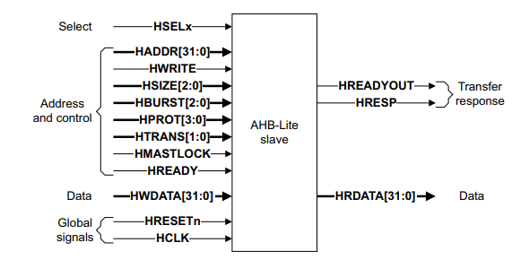

# AMBA Protocol
## Introduction
The AMBA (Advanced Microcontroller Bus Architecture) protocol provides a hierarchical structure for communication within system-on-chip (SoC) designs, enabling efficient data transfers between various components. The hierarchy is divided into three main protocols, each catering to different performance needs:

**AXI (Advanced eXtensible Interface):**

- Position: Top-tier of the hierarchy
- Purpose: Designed for high-performance and high-bandwidth communication. It supports burst transfers, pipelined operations, and out-of-order execution, making it ideal for CPU, memory controllers, and other high-speed peripherals.
**AHB (Advanced High-performance Bus):**

- Position: Mid-tier in the hierarchy
- Purpose: Suited for components that require moderate performance, such as DMA controllers. It provides higher throughput than APB but is simpler than AXI. AHB uses a single master and multiple slaves for communication.
**APB (Advanced Peripheral Bus):**

- Position: Bottom-tier of the hierarchy
- Purpose: Simplified, low-power bus for slower, lower-performance peripherals such as timers or UARTs. APB supports basic read/write operations without advanced features like burst transfers.
This hierarchical structure allows system designers to optimize SoC communication by using the appropriate protocol based on performance and complexity requirements.

*Figure 1: AMBA Architectue*

## AHB slave
we support in this part of the slave memory (SLAVE_MEM).

*Figure 2: AMBA slave*

# Design Methodology 
In this slave (memory) , memory can read or writes data in it depending on control signals from the master.
HREADY signal is deasserted when we need to read from an empty location from memory.

# simulation waveform 

*Figure 2: waveform*