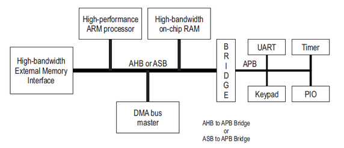
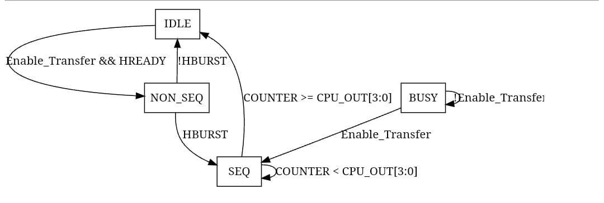
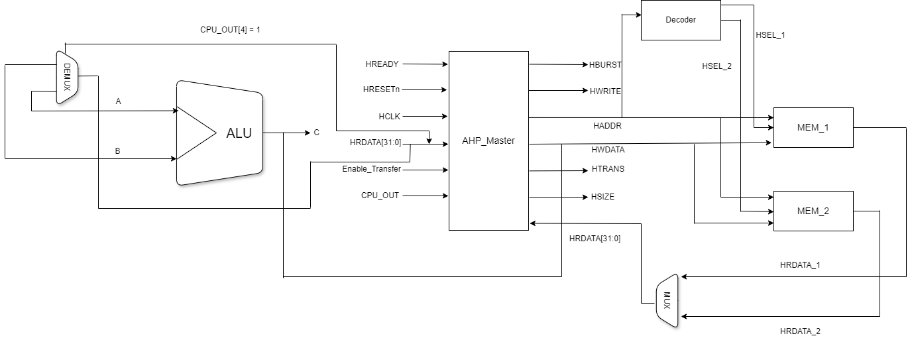
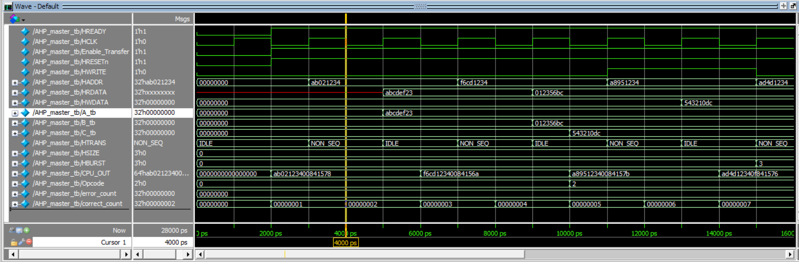
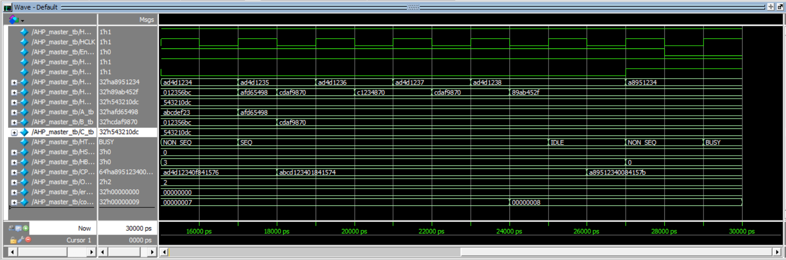
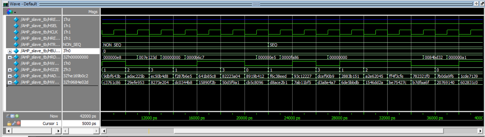

# AMBA Protocol
## Introduction
The AMBA (Advanced Microcontroller Bus Architecture) protocol provides a hierarchical structure for communication within system-on-chip (SoC) designs, enabling efficient data transfers between various components. The hierarchy is divided into three main protocols, each catering to different performance needs:

**AXI (Advanced eXtensible Interface):**

- Position: Top-tier of the hierarchy
- Purpose: Designed for high-performance and high-bandwidth communication. It supports burst transfers, pipelined operations, and out-of-order execution, making it ideal for CPU, memory controllers, and other high-speed peripherals.
**AHB (Advanced High-performance Bus):**

- Position: Mid-tier in the hierarchy
- Purpose: Suited for components that require moderate performance, such as DMA controllers. It provides higher throughput than APB but is simpler than AXI. AHB uses a single master and multiple slaves for communication.
**APB (Advanced Peripheral Bus):**

- Position: Bottom-tier of the hierarchy
- Purpose: Simplified, low-power bus for slower, lower-performance peripherals such as timers or UARTs. APB supports basic read/write operations without advanced features like burst transfers.
This hierarchical structure allows system designers to optimize SoC communication by using the appropriate protocol based on performance and complexity requirements.

*Figure 1: AMBA Architectue*

## AHB Master
The AHB master is a device in the Advanced High-performance Bus (AHB) system that initiates data transfers by requesting read or write operations from other components, such as memory or peripherals. It controls the communication, while the connected slaves respond to its commands.

The AHB master will be designed using Verilog, following the AMBA® 3 AHB-Lite Protocol v1.0 Specification

## Supported Features

- External interface (ALU interface)
- HBURST
- HTRANS
- HSIZE
- HREADY

## Unsupported Features

- Multilayer AHB-Lite
- Protection (HPROT)
- Master lock (HMASTLOCK)
- WRAP4, INCR4, WRAP8, INCR8, WRAP8, INCR8 of HBURST
- Section 6.2  (Data bus width)

# Design Methodology 

<!--FSM -->
## My_FSM

*Figure 2: FSM*

 - first we start at HTRANS = IDLE , if(Enable_Transfer && HREADY) then HTRANS Transfers to NON_SEQ state , else we still at the IDLE state , in NON_SEQ state and if(Enable_Transfer && HREADY) and if(HBURST == 1) then the next state will be SEQ and HTRANS = SEQ state we are in INCR process , else if(HBURST == 0) we return to the IDLE state HTRANS = IDLE we are in SINGLE transfer process , in SEQ state and if(Enable_Transfer && HREADY) we are still in the SEQ state CPU_OUT[3:0] times and after that we return to the IDLE state HTRANS = IDEL , else if(!Enable_Transfer) then we move to BUSY state and still in this state till Enable_Transfer = 1 then returns to the SEQ state else we remain in BUSY state.

<!--Architecture -->

*Figure 3: AHB Architectue*

## AHB Slave
These are memory or peripheral devices that respond to read or write requests made by a master device.

An AMBA AHB system can have multiple slaves, each mapped to a specific address range. The bus arbiter manages which slave should respond to a master at any given time.

## Supported Features

- slave(MEMORY)

# Design Methodology 

In this slave (memory) , memory can read or writes data in it depending on control signals from the master.
HREADY signal is deasserted when we need to read from an empty location from memory.

# Testing Full Arceticture

*Figure 4: wave_form_1*

- first we start by sending a SINGLE transfer (read) , before that we reset the system by activating HRESETn (active low signal) , due to we enable transfer and HREADY = 1 , then HTRANS move to NON_SEQ state and we found that HBURST = 0 , then next state will be IDLE HTRANS = IDLE , the goal of this transfer is to store in first operand of interfacing with ALU A = 32'hABCDEF32 , then we repeat this SINGLE transfer again (read) to store in the second operand of the ALU B = 32'h012356BC , we do a SINGLE transfer again (write) and compare between golen_model of ALU in test_bench (C_tb) and HWDATA to confirm that we are TRUE.

*Figure 5: wave_form_2*

- we start by sending a INCR transfer Process (read) , HTRNS = IDLE amd if(Enable_Transfer && HREADY) then HTRNS will moe to NON_SEQ state , due to HBURST = 3 then HTRANS will move to SEQ state and will remain in SEQ state till COUNTER == CPU_OUT[3:0] = 4 , then returns to the IDLE state HTRANS = IDLE , In the IDLE state and if(Enable_Transfer && HREADY) then HTRNS will moe to NON_SEQ state , in NON_SEQ state and if(!Enable_Transfer) then we move to BUSY state and still in the BUSY state till Enable_Transfer = 1 then returns to IDLE state.

*Figure 6: wave_form_3*

# Future Work

More slaves will be added to this Protocol.

